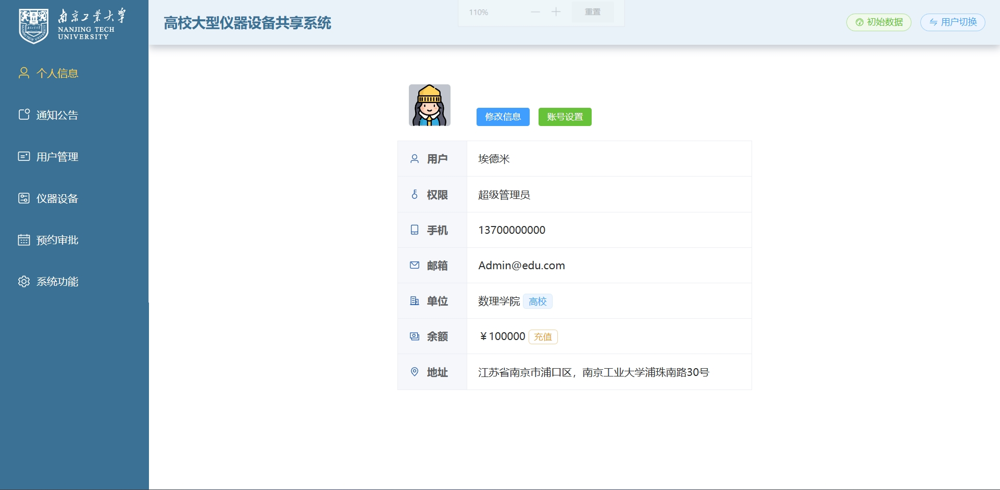
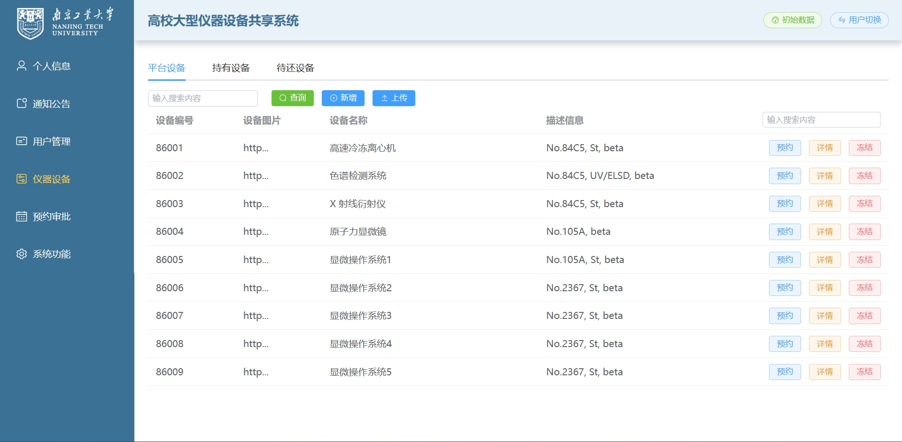
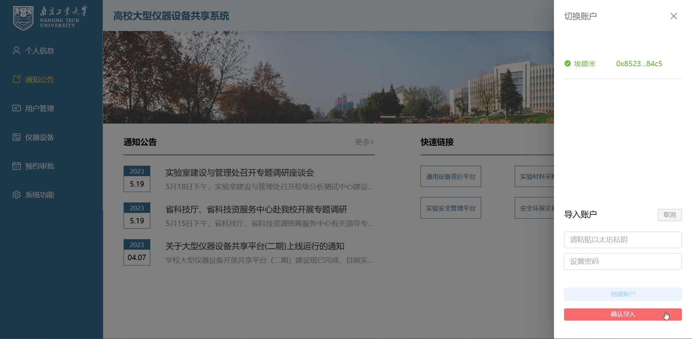

# 基于以太坊平台的设备共享系统
 
本项目是基于以太坊平台开发的 Dapp。前端采用了 Vue3 框架，Element Plus 组件，智能合约为 Solidity 语言。
 
  
### 智能合约编译

#### Remix IDE 编译

#### Truffle 框架编译
智能合约目录 `truffle/contract`
编译配置文件 `truffle/truffle-config.js` 
### 以太坊部署

### 系统功能展示

